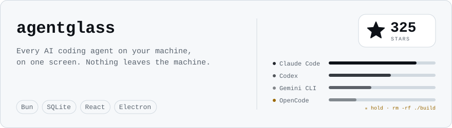
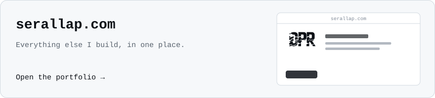
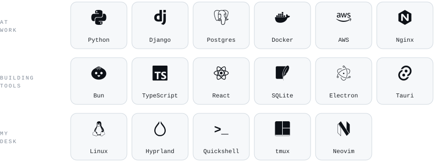

<!-- Generado por scripts/build_profile.mjs; no editar a mano. -->
<picture>
  <source media="(max-width: 600px) and (prefers-color-scheme: dark)" srcset="assets/header-m-dark.svg">
  <source media="(max-width: 600px)" srcset="assets/header-m-light.svg">
  <source media="(prefers-color-scheme: dark)" srcset="assets/header-dark.svg">
  
</picture>

## Work

<a href="https://github.com/SirAllap/agentglass">
<picture>
  <source media="(max-width: 600px) and (prefers-color-scheme: dark)" srcset="assets/agentglass-m-dark.svg">
  <source media="(max-width: 600px)" srcset="assets/agentglass-m-light.svg">
  <source media="(prefers-color-scheme: dark)" srcset="assets/agentglass-dark.svg">
  
</picture>
</a>

<a href="https://serallap.com">
<picture>
  <source media="(max-width: 600px) and (prefers-color-scheme: dark)" srcset="assets/portfolio-m-dark.svg">
  <source media="(max-width: 600px)" srcset="assets/portfolio-m-light.svg">
  <source media="(prefers-color-scheme: dark)" srcset="assets/portfolio-dark.svg">
  
</picture>
</a>

## Stack

<picture>
  <source media="(max-width: 600px) and (prefers-color-scheme: dark)" srcset="assets/stack-m-dark.svg">
  <source media="(max-width: 600px)" srcset="assets/stack-m-light.svg">
  <source media="(prefers-color-scheme: dark)" srcset="assets/stack-dark.svg">
  
</picture>

## Activity

<picture>
  <source media="(max-width: 600px) and (prefers-color-scheme: dark)" srcset="assets/activity-m-dark.svg">
  <source media="(max-width: 600px)" srcset="assets/activity-m-light.svg">
  <source media="(prefers-color-scheme: dark)" srcset="assets/activity-dark.svg">
  
</picture>

## Say hi

<a href="https://serallap.com"><picture><source media="(prefers-color-scheme: dark)" srcset="assets/link-site-dark.svg"></picture></a>
<a href="https://www.linkedin.com/in/davidpallaresrobaina/"><picture><source media="(prefers-color-scheme: dark)" srcset="assets/link-linkedin-dark.svg"></picture></a>
<a href="mailto:david.pr.developer@gmail.com"><picture><source media="(prefers-color-scheme: dark)" srcset="assets/link-mail-dark.svg"></picture></a>

